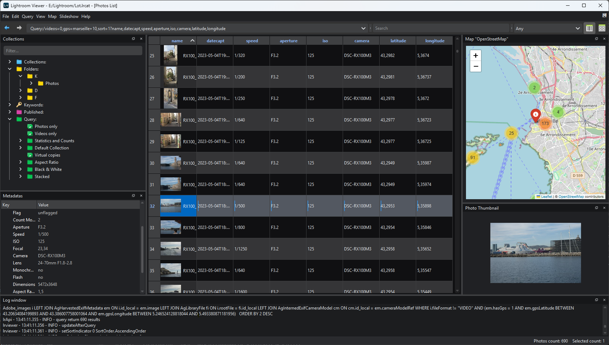

# LrViewer
LrViewer is a Lightroom viewer without Lightroom.

## Overview

LrViewer is a python application, displaying photos and metadatas from Lightroom catalog :

* Lightroom catalogs (*.lrtcat) opened in readonly, accessed with my library [Lightroom-SQL-tools](https://github.com/fdenivac/Lightroom-SQL-tools)
* Display Lightroom collections : standard collections, smart collections (not fully supported), folders, keywords, published collections
* Allow specific queries using [Lightroom-SQL-tools syntax](https://github.com/fdenivac/Lightroom-SQL-tools#using-lrselect-script)
* The images displayed come from Lightroom cache (in "`<CATALOG> Previews.lrcat`" folder).

<BR>




## Installation
```
pip install -U git+https://github.com/fdenivac/lrviewer
```
lrviewer application is installed in "Scripts" folder of python.


## Usage
Lrviewer is a GUI application, with optionnal command line :

```
> lrviewer --help
usage: appLrView.py [-h] [-b LRCAT] [-S] [-t TIMER] [-D {dark,light,qdark,none}] [-V] [columns] [criteria]

View Photos from Lightroom catalog

positional arguments:
  columns               Initial columns to display
  criteria              Initial criteria (for syntax: see project "Lightroom-SQL-tools" on github)

options:
  -h, --help            show this help message and exit
  -b LRCAT, --lrcat LRCAT
                        Ligthroom catalog file for database request (default:"E:/Lightroom/La Totale/La Totale.lrcat")
  -S, --slideshow       Start slideshow in fullscreen
  -t TIMER, --timer TIMER
                        Seconds between slide (used with --slideshow option)
  -D {dark,light,qdark,none}, --dark-theme {dark,light,qdark,none}
                        Theme to use
  -V, --version         Show version and exit
```

### Launch Application
* When installed via pip, lrviewer is located in python Scripts directory, accessible from python environment.
```
> lrviewer
```

* From project cloned, execute something as:
```
cd <DIR>/LrViewer/scr/lrviewer
python appLrView.py
```

## Build standalone executable with Nuitka
* install python Nuitka module
* execute :
```
cd <PROJECT>/src/lrviewer
python -m nuitka \
    --standalone --onefile \
    --enable-plugin=pyside6 \
    --windows-icon-from-ico=ico/lrviewer48x48.png \
    --include-data-dir=slideshow/=slideshow/ \
    --include-data-dir=ico/=ico/ \
    --output-dir=../../build/nuitka \
    --output-filename=lrviewer \
    appLrView.py
```
